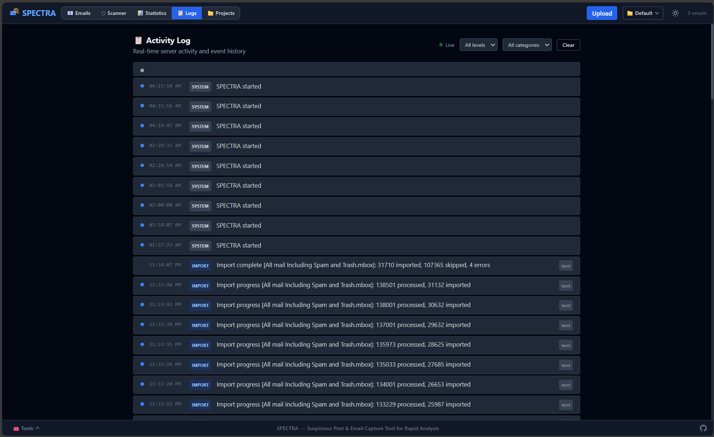

# SPECTRA

**S**uspicious **P**ost & **E**mail **C**apture **T**ool for **R**apid **A**nalysis

A containerized email forensics platform for DFIR analysts. Import email archives, search with full-text queries, run YARA scans, and analyze suspicious indicators // all from a browser.

## Quick Start

```bash
docker compose up -d
```

Open **http://localhost:3000** in your browser.



## Features

- **Multi-format import**: EML, MSG, MBOX, PST, OST, OLM, EDB
- **Full-text search**: FTS5-powered queries with field filters (`from:`, `to:`, `subject:`, `has:attachment`), boolean operators (`AND`, `OR`, `NOT`), and date ranges
- **Forensic analysis**: 9 heuristic checks on raw headers (spoofing, relay anomalies, forged timestamps, impersonation)
- **YARA scanning**: Write and run YARA rules against email bodies, headers, and attachments with persistent rule storage
- **Statistics dashboard**: Volume over time, top senders/domains, hourly distribution
- **Project/case management**: Isolate cases into separate databases with per-project data
- **Folder watcher**: Drop files into `watch/` for automatic background import
- **Export**: Individual EML download, CSV bulk export, and email-to-image rendering
- **Standalone tools**: Browser-based PST Repair, EML Viewer, and MSG Viewer (no server required)
- **Dark mode**: System-aware with manual toggle

| Service | Stack | Port |
|---------|-------|------|
| Frontend | Vue 3.4, Vite 5, Tailwind CSS, Nginx | 3000 |
| Backend | FastAPI, SQLite FTS5/WAL, Python 3.11 | 8000 |

## Scanner

The forensic scanner runs 9 heuristic checks on raw email headers:

| # | Check | Severity | Detects |
|---|-------|----------|---------|
| 1 | Reply-To ≠ From | HIGH | Phishing redirect |
| 2 | Free provider + org name | HIGH | Impersonation |
| 3 | Long received chain | MEDIUM | Anonymizer relaying |
| 4 | Large hop delay | MEDIUM | Suspicious relay queuing |
| 5 | Negative hop delay | HIGH | Forged Received headers |
| 6 | Suspicious X-Mailer | MEDIUM | Automated sending tools |
| 7 | Missing Message-ID | LOW | Bulk/automated mail |
| 8 | Spam headers present | LOW | Upstream spam flags |
| 9 | Return-Path ≠ From domain | MEDIUM | Envelope spoofing |

> **Note:** All checks require raw headers. Emails from sources that strip raw headers will show "Unknown" risk.
